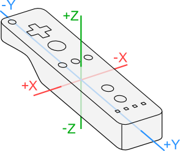

| Supported Targets | ESP32 |
| ----------------- | ----- |

```
[](https://github.com/pknessness/ESPmote_PCB)
```

# ESPmote

This code is for an ESP Wiimote emulator, the ESPmote. This is intended to be a full replacement for a Wiimote, with an accompanying drop-in replacement PCB, which you can find [here](https://github.com/pknessness/ESPmote_PCB), and this code is written for said board.

The original Wiimote is built around a Broadcom BCM2042, and my ESPmote is build around ESP32 (Only the original chip, any of the C or S variants, as none of them support Bluetooth Classic which is necessary to communicate with the Wii). Wiimotes are known to use an ADXL330 for accelerometer data and the Wii Motion Plus (WM+ or WMP) uses an InvenSense IDG-600 for pitch and roll and an EPSON TOYOCOM X3500 for yaw. ESPmote supports WM+ [TODO: Implement billiard26 WM+ handshake math] and uses an LSM6DS3 for both accelerometer and gyro. 

I attempted to replace the IR camera with a HM01B0 and pico, but due to size constraints and my lack of optics knowledge, that avenue fell through. The ESPmote currently uses an existing Wiimote's IR Camera. 

# Memory ([Wiibrew](https://wiibrew.org/wiki/Wiimote#EEPROM_Memory))

## EEPROM

### Calibration (Accelerometer, Motor, Volume)

### Mii Data

## Registers

### Speaker Settings

### Extension Controller Settings/Data

### Wii Motion Plus Settings/Data

### IR Camera Settings

This is currently believed to relate directly to the registers on the Pixart IR Camera

# Button Data ([Wiibrew](https://wiibrew.org/wiki/Wiimote#Buttons))

Buttons are two bytes of data, this is how those bits are organized

| Bit | Mask | First Byte   | Second Byte  |
| --- | ---- | ------------ | ------------ |
| 0   | 0x01 | DPAD LEFT    | TWO          |
| 1   | 0x02 | DPAD RIGHT   | ONE          |
| 2   | 0x04 | DPAD DOWN    | B            |
| 3   | 0x08 | DPAD UP      | A            |
| 4   | 0x10 | PLUS         | MINUS        |
| 5   | 0x20 | <Accel LSBs> | <Accel LSBs> |
| 6   | 0x40 | <Accel LSBs> | <Accel LSBs> |
| 7   | 0x80 | unknown      | HOME         |

# Accelerometer Data ([Wiibrew](https://wiibrew.org/wiki/Wiimote#Accelerometer))

Accelerometer data is three unsigned values of 10-bits each for X Y and Z. There are three designated bytes for accelerometer data, which is in the format XX YY and ZZ and stores the high 8 bits of each accelerometer value, and then the remaining 2 bits are stored in the excess of the buttons data, but it's key to note that X gets both bits represented, while Y and Z only store the higher of the two remaining bits, while the last bit is considered always 0.

Because accelerometer data is unsigned, our zero value for the accelerometer is 512. The value of +- 1G depends on the accelerometer values in the calibration section of memory, but is generally 100.

<table style="border-collapse: collapse; padding: 0.2em 0.2em 0.2em 0.2em; text-align: center;">
<tbody><tr style="background-color: #ddd;">
<td style="background-color: #fff;" colspan="2"> 
</td>
<td style="border: 1px solid #ccc; padding: 0.2em; text-align: center;" colspan="8"><b>Bit</b>
</td></tr>
<tr style="background-color: #cdc;">
<td style="border: 1px solid #ccc; padding: 0.2em; background-color: #ddd;"><b>Byte</b>
</td>
<td style="border: 1px solid #ccc; padding: 0.2em; width:2em;"><b>7</b>
</td>
<td style="border: 1px solid #ccc; padding: 0.2em; width:2em;"><b>6</b>
</td>
<td style="border: 1px solid #ccc; padding: 0.2em; width:2em;"><b>5</b>
</td>
<td style="border: 1px solid #ccc; padding: 0.2em; width:2em;"><b>4</b>
</td>
<td style="border: 1px solid #ccc; padding: 0.2em; width:2em;"><b>3</b>
</td>
<td style="border: 1px solid #ccc; padding: 0.2em; width:2em;"><b>2</b>
</td>
<td style="border: 1px solid #ccc; padding: 0.2em; width:2em;"><b>1</b>
</td>
<td style="border: 1px solid #ccc; padding: 0.2em; width:2em;"><b>0</b>
</td></tr>
<tr style="background-color: #ded;">
<td style="border: 1px solid #ccc; padding: 0.2em; background-color: #eee;">0
</td>
<td style="border: 1px solid #ccc; padding: 0.2em; background-color: #ddd;"> 
</td>
<td style="border: 1px solid #ccc; padding: 0.2em;" colspan="2"><b>X</b><span style="color: #777;"><<span style="color: #c00;">1:0</span>></span>
</td>
<td style="border: 1px solid #ccc; padding: 0.2em; background-color: #ddd;" colspan="5"> 
</td></tr>
<tr style="background-color: #ded;">
<td style="border: 1px solid #ccc; padding: 0.2em; background-color: #eee;">1
</td>
<td style="border: 1px solid #ccc; padding: 0.2em; background-color: #ddd;"> 
</td>
<td style="border: 1px solid #ccc; padding: 0.2em;"><b>Z</b><span style="color: #777;"><<span style="color: #c00;">1</span>></span>
</td>
<td style="border: 1px solid #ccc; padding: 0.2em;"><b>Y</b><span style="color: #777;"><<span style="color: #c00;">1</span>></span>
</td>
<td style="border: 1px solid #ccc; padding: 0.2em; background-color: #ddd;" colspan="5"> 
</td></tr></tbody></table>

This image shows the sign of the accelerometer values.



For example, if the wiimote is in the shown configuration, we would get a + value on Z.

# Gyroscope Data ([Wiibrew](https://wiibrew.org/wiki/Wiimote#Accelerometer))

Gyro data is in 6 bits, as shown below. Slow mode means that 

<table style="border-collapse: collapse; padding: 0.2em 0.2em 0.2em 0.2em; text-align: center;">
<tbody><tr style="background-color: #ddd;">
<td style="background-color: #fff;"> 
</td>
<td style="border: 1px solid #ccc; padding: 0.2em; text-align: center;" colspan="8"><b>Bit</b>
</td></tr>
<tr style="background-color: #cdc;">
<td style="border: 1px solid #ccc; padding: 0.2em; background-color: #ddd;"><b>Byte</b>
</td>
<td style="border: 1px solid #ccc; padding: 0.2em; width:3.3em;"><b>7</b>
</td>
<td style="border: 1px solid #ccc; padding: 0.2em; width:3.3em;"><b>6</b>
</td>
<td style="border: 1px solid #ccc; padding: 0.2em; width:3.3em;"><b>5</b>
</td>
<td style="border: 1px solid #ccc; padding: 0.2em; width:3.3em;"><b>4</b>
</td>
<td style="border: 1px solid #ccc; padding: 0.2em; width:3.3em;"><b>3</b>
</td>
<td style="border: 1px solid #ccc; padding: 0.2em; width:3.3em;"><b>2</b>
</td>
<td style="border: 1px solid #ccc; padding: 0.2em; width:3.3em;"><b>1</b>
</td>
<td style="border: 1px solid #ccc; padding: 0.2em; width:3.3em;"><b>0</b>
</td></tr>
<tr style="background-color: #ded;">
<td style="border: 1px solid #ccc; padding: 0.2em; background-color: #eee;">0
</td>
<td style="border: 1px solid #ccc; padding: 0.2em;" colspan="8"><b>Yaw Down Speed</b><span style="color: #777;"><<span style="color: #c00;">7:0</span>></span>
</td></tr>
<tr style="background-color: #ded;">
<td style="border: 1px solid #ccc; padding: 0.2em; background-color: #eee;">1
</td>
<td style="border: 1px solid #ccc; padding: 0.2em;" colspan="8"><b>Roll Left Speed</b><span style="color: #777;"><<span style="color: #c00;">7:0</span>></span>
</td></tr>
<tr style="background-color: #ded;">
<td style="border: 1px solid #ccc; padding: 0.2em; background-color: #eee;">2
</td>
<td style="border: 1px solid #ccc; padding: 0.2em;" colspan="8"><b>Pitch Left Speed</b><span style="color: #777;"><<span style="color: #c00;">7:0</span>></span>
</td></tr>
<tr style="background-color: #ded;">
<td style="border: 1px solid #ccc; padding: 0.2em; background-color: #eee;">3
</td>
<td style="border: 1px solid #ccc; padding: 0.2em;" colspan="6"><b>Yaw Down Speed</b><span style="color: #777;"><<span style="color: #c00;">13:8</span>></span>
</td>
<td style="border: 1px solid #ccc; padding: 0.2em;"><b>Yaw slow mode</b>
</td>
<td style="border: 1px solid #ccc; padding: 0.2em;"><b>Pitch slow mode</b>
</td></tr>
<tr style="background-color: #ded;">
<td style="border: 1px solid #ccc; padding: 0.2em; background-color: #eee;">4
</td>
<td style="border: 1px solid #ccc; padding: 0.2em;" colspan="6"><b>Roll Left Speed</b><span style="color: #777;"><<span style="color: #c00;">13:8</span>></span>
</td>
<td style="border: 1px solid #ccc; padding: 0.2em;"><b>Roll slow mode</b>
</td>
<td style="border: 1px solid #ccc; padding: 0.2em;"><b>Extension connected</b>
</td></tr>
<tr style="background-color: #ded;">
<td style="border: 1px solid #ccc; padding: 0.2em; background-color: #eee;">5
</td>
<td style="border: 1px solid #ccc; padding: 0.2em;" colspan="6"><b>Pitch Left Speed</b><span style="color: #777;"><<span style="color: #c00;">13:8</span>></span>
</td>
<td style="border: 1px solid #ccc; padding: 0.2em; background-color: #ddd; color:#888;">1
</td>
<td style="border: 1px solid #ccc; padding: 0.2em; background-color: #ddd; color:#888;">0
</td></tr></tbody></table>

# IR Camera Data ([Wiibrew](https://wiibrew.org/wiki/Wiimote#IR_Camera))

## IR Camera Control Registers (0xB00000 - 0xB00033)

<table><thead>
  <tr>
    <th></th>
    <th>0x0</th>
    <th>0x1</th>
    <th>0x2</th>
    <th>0x3</th>
    <th>0x4</th>
    <th>0x5</th>
    <th>0x6</th>
    <th>0x7</th>
    <th>0x8</th>
    <th>0x9</th>
    <th>0xA</th>
    <th>0xB</th>
    <th>0xC</th>
    <th>0xD</th>
    <th>0xE</th>
    <th>0xF</th>
  </tr></thead>
<tbody>
  <tr>
    <td>0xB00000</td>
    <td colspan="9">Sensitivity 1</td>
    <td></td>
    <td></td>
    <td></td>
    <td></td>
    <td></td>
    <td></td>
    <td></td>
  </tr>
  <tr>
    <td>0xB00010</td>
    <td></td>
    <td></td>
    <td></td>
    <td></td>
    <td></td>
    <td></td>
    <td></td>
    <td></td>
    <td></td>
    <td></td>
    <td colspan="2">Sensitivity 2</td>
    <td></td>
    <td></td>
    <td></td>
    <td></td>
  </tr>
  <tr>
    <td>0xB00020</td>
    <td></td>
    <td></td>
    <td></td>
    <td></td>
    <td></td>
    <td></td>
    <td></td>
    <td></td>
    <td></td>
    <td></td>
    <td></td>
    <td></td>
    <td></td>
    <td></td>
    <td></td>
    <td></td>
  </tr>
  <tr>
    <td>0xB00030</td>
    <td>STATUS</td>
    <td></td>
    <td></td>
    <td>MODE</td>
    <td></td>
    <td></td>
    <td></td>
    <td></td>
    <td></td>
    <td></td>
    <td></td>
    <td></td>
    <td></td>
    <td></td>
    <td></td>
    <td></td>
  </tr>
</tbody></table>

This is the IR Camera internal registers, believed to match up to the Wiimote's control registers 0xB00000 to 0xB00033. Potential IR Calibration blocks can be found on the wiibrew page. STATUS is set to 0x01 when setting up, then 0x08 when setup is complete. MODE is one of the three data reporting modes, 0x01, 0x03, or 0x05, but can also be set to 0x33, and what this means is unknown.

## Input Data Format

### Basic Data (0x01) [(5 bytes)](https://wiibrew.org/wiki/Wiimote#Basic_Mode)

### Extended Data (0x03) [(12 bytes)](https://wiibrew.org/wiki/Wiimote#Extended_Mode)

### Full Data (0x05) [(36 bytes)](https://wiibrew.org/wiki/Wiimote#Full_Mode)

# Notes

When looking through code and my notes above, I am sticking with the HID convention that I observed when writing the code, which is that output and input are relative to the HID Host, which in this case is the Wii. Reports leaving the wiimote are input reports, and reports leaving the wii are output reports.

# Credits

Thanks to

- [Dolphin Emulator](https://dolphin-emu.org/) devs (especially @billiard26)

- [Kako's blog](http://www.kako.com/neta/index.html)

- Contributors of [Wiibrew's wiimote page](https://wiibrew.org/wiki/Wiimote)

- 

If you have questions about my process or about the code, email me at pk.ness.ness@gmail.com.
